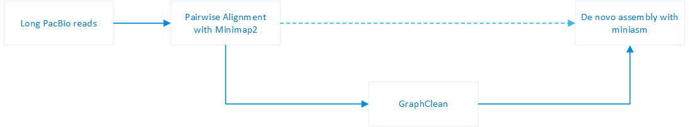

## Getting Started

```sh
python GraphClean.py potato-overlaps.paf results/potato #Find and remove repeat induced overlaps in potato-overlaps.paf and print the normal overlaps to results/potato-newoverlaps.paf
python Graphclean.py potato-overlaps.paf results/potato -m models/model-potato-c0.01 -t 0.1 #Find and remove repeat induced overlaps in potato-overlaps.paf using models/model-potato-c0.01 model and 0.1 threshold and print the normal overlaps to results/potato-newoverlaps.paf
```

# GraphClean
Assembly graph cleaning through machine learning improves de novo long-read assembly

